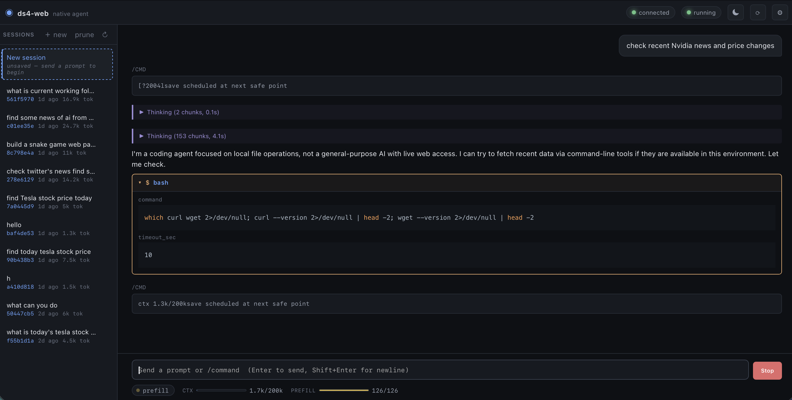

# ds4-webui

A web UI for [`ds4-agent`](https://github.com/antirez/ds4), the native coding agent for DeepSeek V4 Flash. It runs `ds4-agent` in a pty and talks to it over that, so there are no patches to the upstream code. The browser gets markdown, syntax-highlighted code, collapsible thinking sections, tool-call cards that fill in as the model writes them, a sidebar of saved sessions, a live status panel, and a settings drawer.

This was vibe coded with Claude Code over a few sessions, so treat it as a personal tool rather than production software. It works, but it has rough edges.

It is also an independent project. It wraps `ds4-agent` and ships none of its source.



```
ds4-agent  <-- pty -->  python daemon (FastAPI)  <-- WebSocket -->  browser
                  \                            /
                   '--- tails --trace file ---'
```

## Quick start

```sh
cd ds4-web
./run.sh
```

The first run creates a venv, installs the requirements, starts the server on `http://127.0.0.1:8810`, and opens it in your browser. The agent starts on its own using whatever is in `settings.json`. If that file does not exist yet, the defaults in `settings.py` are used (200k context, normal thinking, MTP on).

For this to work you need `ds4-agent` already built, a DeepSeek V4 Flash GGUF, and the optional MTP GGUF. Point the settings at them (see below). The default paths assume the layout in the antirez/ds4 repo on the same machine.

### Environment overrides

```sh
DS4_WEB_PORT=9000     ./run.sh   # serve on a different port
DS4_WEB_HOST=0.0.0.0  ./run.sh   # bind all interfaces for LAN or remote use
DS4_WEB_NO_OPEN=1     ./run.sh   # do not auto-open the browser
```

## Using it

**Send a prompt.** Type in the box at the bottom and press Enter. Shift+Enter makes a newline without sending. The first prompt of a fresh agent is slow because the model has to load; after that it is quick.

**Watch it work.** While the agent thinks, its reasoning streams into a thinking block. Once it starts answering, that block collapses to a one-line summary like `Thinking (153 chunks, 4.1s)` that you can click to reopen. The answer renders as markdown as it arrives, with syntax highlighting on code and a copy button when you hover a code block.

**Tool calls.** When the agent runs a tool (read a file, run bash, write a file), a card appears and fills in live. For a file write you watch the contents stream into the card instead of waiting for the whole thing. Each card shows the tool name and its parameters.

**Stop.** The Send button turns into Stop while the agent is generating. Clicking it interrupts the current turn without throwing away the session, so you can send a new prompt and keep going.

**Web-tool approval.** Newer `ds4-agent` has browser-backed web tools that open a visible Chrome window, and it asks for a yes or no before starting one. The wrapper catches that prompt and shows an Allow or Deny dialog with the agent's 30 second auto-deny countdown. The Chrome window itself opens on your desktop. The wrapper only handles the approval, and if you do nothing the agent denies on its own.

**Slash commands.** Anything you type starting with `/` is sent to the agent as a command rather than a prompt. The useful ones are `/save`, `/new`, `/list`, `/switch <sha>`, `/history`, and `/help`. Most of these have buttons in the UI too, so you rarely need to type them.

**Sessions.** Every conversation is a session, stored in the agent's KV cache on disk. The left sidebar lists them, newest first, with a short SHA, an age, and a token count. Click any session to switch to it instantly (the agent reloads its saved KV, so there is no reprefill). The `+ new` button starts a fresh conversation and drops a placeholder row at the top until the first prompt is saved. Autosave is on by default, so a session is saved after each turn; you can also save by hand with `/save`. The `prune` button keeps only the last five, and each row has a delete button on hover.

## The interface

**Top bar.** On the right are a connection indicator (whether the browser is connected to the daemon), an agent state badge (stopped, starting, running, stopping), a theme toggle, a restart-agent button, and the settings gear.

**Sessions sidebar.** The session list described above, with `+ new`, `prune`, and a refresh button.

**Conversation.** Your prompts show as bubbles on the right. The agent's turns show on the left and can contain a thinking block, markdown content, and tool cards, interleaved in the order they happened. Slash-command output (like the saved-sessions list) shows in its own boxes.

**Composer.** The input box at the bottom, plus the Send / Stop button.

**Status bar.** Along the bottom: a state pill (idle, prefill, generation, and so on), the context fill gauge as used over total, a prefill progress bar while the prompt is being read, and the generation speed in tokens per second while the agent is answering.

## Settings

Open the drawer with the gear icon. It is grouped into sections. Most settings are launch flags for `ds4-agent`, so saving them restarts the agent. Your sessions live on disk, so a restart does not lose them. Interface settings apply instantly with no restart. The Apply button tells you which case you are in, and there is a Reset defaults button.

**Model** (restart)
- Agent binary: path to the `ds4-agent` executable.
- Model GGUF: path to the DeepSeek V4 Flash model file.

**Context and length** (restart)
- Context window: total token budget for system prompt, history, and KV cache. The slider runs from 4k to 1M and shows a rough memory estimate. Larger uses more memory.
- Max tokens per turn: hard cap on how many tokens the agent generates in one reply before it stops.

**Reasoning** (restart)
- Off, normal, or max. Off answers directly. Normal thinks first. Max uses extended thinking when the context is large enough.

**Sampling** (restart)
- Three presets (Precise, Balanced, Creative) set the three sliders at once.
- Temperature (0 to 2): higher is more random and creative, lower is more focused and repeatable.
- Top-p: nucleus sampling, keep the most likely tokens up to this cumulative probability.
- Min-p: drop tokens below this fraction of the top token's probability.
- Seed: fix it for repeatable output, 0 means random each run.
- Note: `ds4-agent` only supports these four knobs. There is no top-k, repeat penalty, mirostat, or grammar like llama.cpp has, so this section does not pretend to offer them.

**Speculative decoding (MTP)** (restart)
- Enabled, the draft model GGUF path, the number of draft tokens (1 to 4), and the verifier margin. MTP makes generation faster with identical output.

**System prompt** (restart)
- Extra text appended to the agent's built-in system prompt. Leave it empty to use the default.

**Advanced and performance** (restart, collapsed by default)
- Backend: auto-detect, or force metal, cuda, or cpu.
- CPU threads: helper threads, 0 lets the agent decide.
- Quality kernels: prefer exact, slower kernels.
- Warm weights: touch the model's memory pages at startup before the first run.
- GPU power: target GPU duty cycle from 1 to 100 percent. Lower runs cooler and quieter but slower. 100 is full speed.

**Interface** (instant)
- Theme: dark or light.
- Autosave: save the session after each turn so it shows up in the sidebar.

## What it is, and what it is not

It is a thin layer that turns the existing `ds4-agent` terminal UI into a browser frontend. All the inference happens in `ds4-agent`. The daemon only relays events.

It is not a replacement for `ds4-agent`. If something does not work here, run `ds4-agent` in a terminal. It has every feature this wrapper has, and more.

## How it works

1. The daemon spawns `ds4-agent` inside a pty so linenoise gets a real terminal, and passes `--trace /tmp/ds4-web/trace-<pid>-<ts>.log`.
2. A pty reader thread parses the status footer (`ctx X/Y | ...`) and slash-command output. That drives the status panel and the sessions list.
3. A trace reader thread tails the trace file and reads the `token` records, which carry the raw model text with literal `<think>` and DSML tags. A state machine splits the stream into thinking, content, and tool-call segments. It handles the case where the model emits a bare `<｜DSML｜invoke>` with no surrounding `tool_calls` wrapper.
4. Those events go through an asyncio queue and out to every WebSocket client as NDJSON.
5. The browser updates the DOM as events arrive and renders markdown with a vendored copy of `marked` (no CDN).

Sessions and history are read straight from the KV cache files on disk rather than scraped from the terminal, which is more reliable.

## Files

```
ds4-web/
├── README.md
├── requirements.txt
├── run.sh          # launcher: venv, deps, server, browser
├── server.py       # FastAPI app: HTTP, WebSocket, settings, lifecycle
├── agent.py        # AgentProcess: pty, trace tailing, process lifecycle
├── parser.py       # status regex, trace decoder, sessions, thinking + DSML state machines
├── ptyscreen.py    # pyte-based terminal screen reader for pty output
├── settings.py     # load/save settings.json, build the agent argv
├── static/
│   ├── index.html
│   ├── style.css
│   ├── render.js   # markdown, code highlight, thinking + tool-card rendering
│   ├── app.js      # WebSocket client, state, settings drawer
│   └── vendor/     # marked, highlight.js, hljs theme (vendored, no CDN)
├── tests/
│   ├── test_parser.py
│   └── test_agent_logic.py
└── docs/
    └── screenshot.png
```

## Testing

```sh
.venv/bin/python -m unittest discover -s tests
```

47 tests at last count, covering the status parser, the trace decoder, the thinking splitter, the streaming and batch DSML parsers, session listing, and transcript parsing.

With the server running you can also hit the API directly:

```sh
curl http://127.0.0.1:8810/api/settings
curl http://127.0.0.1:8810/api/sessions
```

## API

| Method | Path | Purpose |
| --- | --- | --- |
| GET | `/api/settings` | current settings, plus defaults and restart-key metadata |
| POST | `/api/settings` | save settings, restart the agent if a launch flag changed |
| POST | `/api/agent/{start,stop,restart}` | agent lifecycle |
| GET | `/api/sessions` | saved sessions from the KV cache |
| GET | `/api/sessions/{sha}/history` | parsed transcript for one session |
| DELETE | `/api/sessions/{sha}` | delete a session |
| POST | `/api/sessions/prune` | trim old sessions |
| WS | `/ws` | event stream to the browser |

## Troubleshooting

- `ds4-agent` moved on and the wrapper broke. `ds4-agent` is experimental and changes often; an update can shift the output format the wrapper parses (status labels, session output, DSML). If something stops working after an upstream change, just ask Claude Code or Codex to fetch the latest ds4, rebuild it, see what changed, and fix the wrapper to match. That is how this project has been kept in sync.
- The agent shows as `stopped` right at boot. The `agent_path` in `settings.json` is not executable, or `model` does not point at a real file. Fix it in the settings drawer and Apply.
- The first prompt is slow. The model file has to load onto Metal first. The system log reports the progress.
- `failed to start line editor`. That is `ds4-agent` saying it did not get a tty. It should not happen through this wrapper. If it does, that is a bug.
- Tokens do not stream. Check that `/tmp/ds4-web/trace-*.log` is being written. The trace tailer needs that file.

## License

MIT. `ds4-agent` keeps its own upstream license; see the antirez/ds4 repo.
